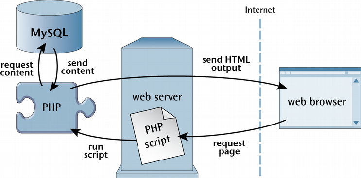
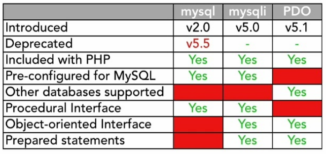
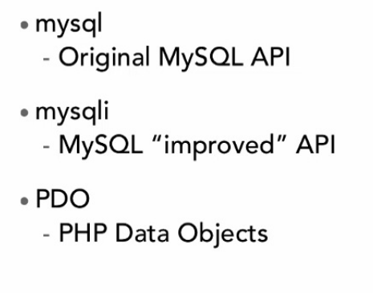
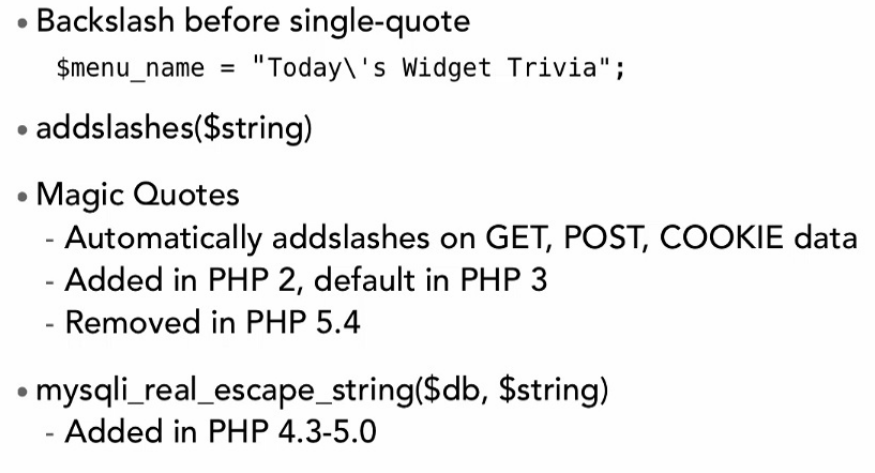

# Database in PHP

## API

* mysql
  * Api originali, deprecate, disabilitate dalla versione 7
* mysqli
  * I=Improved: API migliorate, permettono il procedurale e supportano OOP
* PDO
  * PHP Data Objects

## mysqli procedurale o object orinted

### riferimenti

[manuale php](http://php.net/manual/en/mysqlinfo.api.choosing.php)

## Database, connessione

1. Crea una connessione al database
2. Invia una richiesta al DB
3. Usa i dati ricevuti, se disponibili
4. Rilascia i dati in memoria
5. Chiudi la connessione

## prevenire SQL Injections

